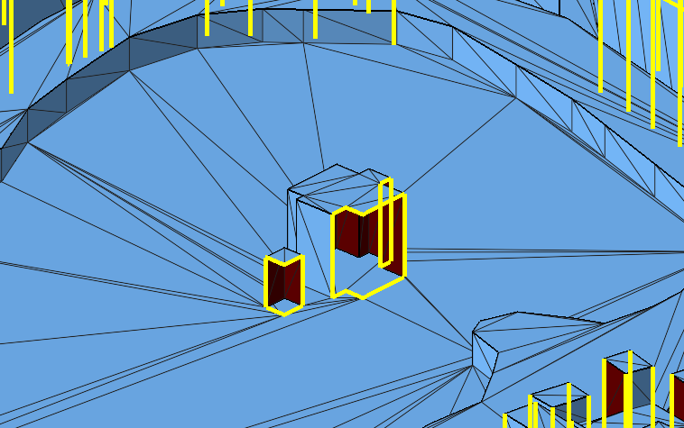
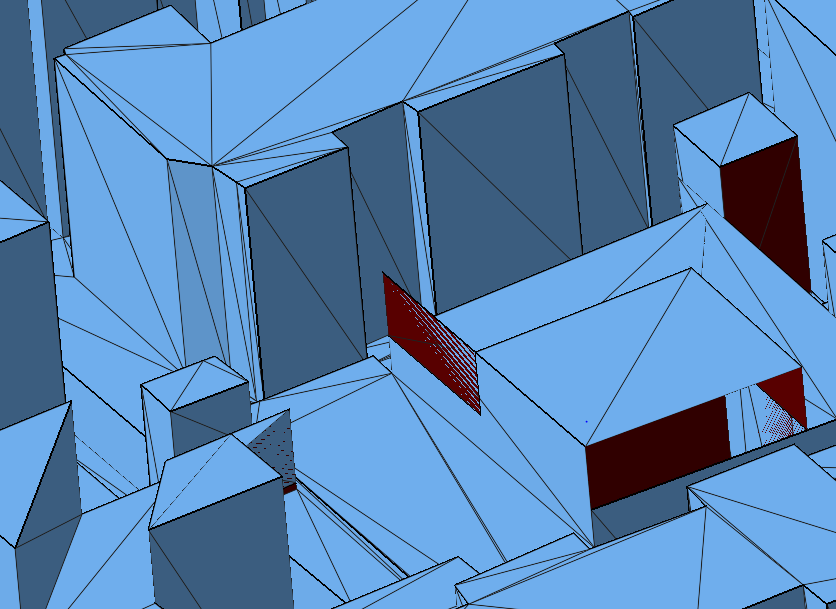
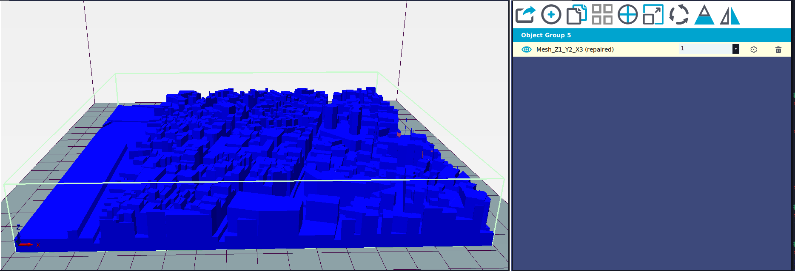
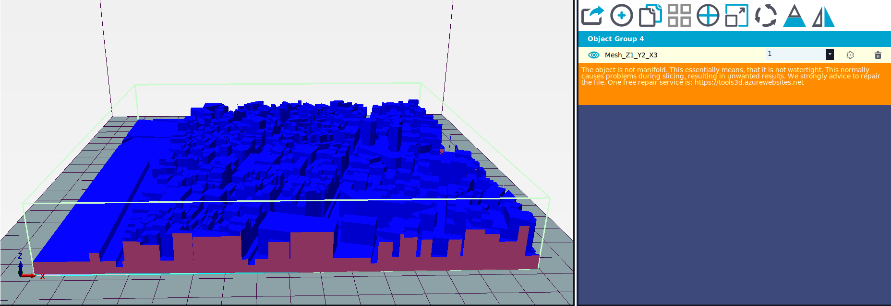

# How-to: Generate STL files from shapefiles

## 1. Install necessary softwares
* [QGIS](https://www.qgis.org/en/site/): very useful software to manipulate shapefiles.
* [Autodesk Netfabb](https://www.autodesk.com/education/free-software/netfabb-premium): repair bad STLs. Available for Windows only.
* [LuBan](https://www.luban3d.com/): split big STL files into smaller pieces. A 6-month premium license can be obtained using a school email.
* [Repetier Host](https://www.repetier.com/): check if the STL is good and ready to be printed.
* [shp2stl](https://github.com/dougmccune/shp2stl): a Nodejs package that converts shapefiles into STL files.
**Note**: this package hasn't been maintained for a few years. We need to manually update **three.js** (one of its dependencies, used for triangulation) to the latest version:
	1. Install specified packages: `npm install`
	2. Navigate to `node_modules/shp2stl/package.json` and change `"three": "^0.66.0"` to `"three": "0.105.1"`
	3. `npm list` to check if the installation is correct

## 2. Prepare the shapefiles with *QGIS*
* Deal with overlaps:
	* Dissolve buffer roads
	* Apply `difference` operation between buildings, naturals and roads
* Generate "ground" shapefile:
	* Merge buildings, roads, naturals,...
	* Extract the rectangular extent
	* Apply `v.clean` on the merged shapefile (else the next step would fail)
	* Apply `difference` on the extent and the merged shapefile
	* Apply `multipart to single parts` on the result (else the STL conversion process will be very slow)
	* Remove features with small area (less than 100):
		* Select the ground shapefile, `Vector -> Geometry Tools -> Add Geometry Attributes`
		* Right click the new shapefile, open attribute tables
		* Filter out features with `"area" < 1` and then remove them
* Merge everything together to get the final shapefile. Remember to use the shapefiles prior to `v.clean` (if not some buildings will go missing after conversion)

## 3. Produce the STL file
* Set some important parameters for the STL file:
	* `extrudeBy` - Either the name of the property in the shapefile to use for the z-axis extrusion, or a function that takes a topojson object representing each shape and returns a number. Required.
	* `width` - The width in STL units to resize the 3D model to. Most 3D printers operate in millimeter units, so typically you'll want to set this to the desired mm. If this is unset then the model will not be resized and will be created in the map units, which will depend on your map's projection and bounds. Optional, but recommended.
	* `height` - The height in STL units to make the model. This will be the height of the highest poly in your shapefile. Required.
* Run the `convert.js` script
```node convert.js input_file output_file```

## 4. Repair the STL file with *Netfabb*
* Some errors must be repaired manually:
	* Holes that are ambiguous to be automatically closed. Solution: manually add triangles.
	
	* Redundant triangles due to bad triangulation. Solution: manually remove triangles.
	
* Run the "extended repair" script

## 5. Split the STL file with *LuBan*
* Mesh > Split
* Choose grid cut, set number of sections of your choice and plug depth to 0

## 6. Repair (again) the splitted STL files with *Netfabb*
* Run the "default repair" script on the splitted files

## 7. Check your results with *Repetier-Host*
* If the non-manifold error doesn't appear then you are good to go!
	* File is ready to print:
	
	* File still needs repairing
	
